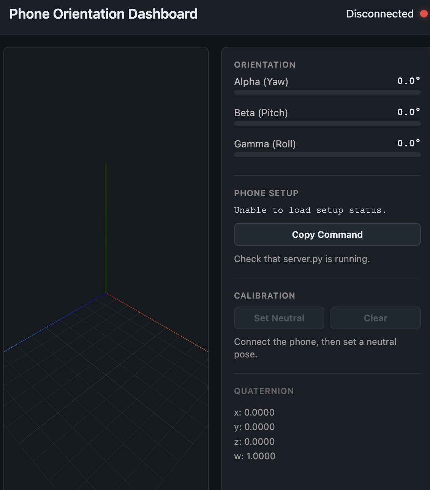

# Phone Orientation Dashboard

Stream real-time phone orientation data from Android (Termux) to your laptop and visualize it with a 3D axes diagram and live readouts.

## Preview



## Setup

### Laptop

```bash
cd ~/phone_controller
uv sync
uv run python server.py
```

The server will start two services:
- **HTTP Dashboard**: http://localhost:8080 (open in browser)
- **WebSocket Server**: ws://localhost:8765 (for phone + browser connections)

### Phone (Android + Termux)

1. **Install Termux:API**
   - Install the Termux:API app from F-Droid (not Play Store)
   - Install the Termux app from F-Droid

2. **Set up Termux**
   ```bash
   pkg update && pkg install termux-api python
   pip install websockets
   ```

3. **Copy `phone_client.py` to Termux** and run it:
   ```bash
   python phone_client.py --server 192.168.x.x
   ```
   Replace `192.168.x.x` with your laptop's local IP on the same WiFi network.

## Usage

1. Open the dashboard in a browser: http://<laptop-ip>:8080
2. Status shows "Waiting..." (red dot)
3. Run `phone_client.py` on the phone
4. Status changes to "Connected" (green dot)
5. Tilt the phone — the 3D axes rotate in real-time

The right panel shows:
- **Alpha (Yaw)**: rotation around Z axis (0–360°)
- **Beta (Pitch)**: rotation around X axis (-90 to +90°)
- **Gamma (Roll)**: rotation around Y axis (-90 to +90°)
- **Quaternion**: raw x, y, z, w values

## Data Format

Phone → Server → Browser (JSON over WebSocket):

```json
{
  "type": "orientation",
  "quaternion": {
    "x": 0.12,
    "y": 0.34,
    "z": 0.05,
    "w": 0.93
  }
}
```

The server also emits a normalized controller message after each orientation
update so other apps can consume phone tilt without doing quaternion math:

```json
{
  "type": "controller",
  "axes": {
    "yaw": 0.0,
    "pitch": 0.0,
    "roll": 0.0
  },
  "quaternion": {
    "x": 0.12,
    "y": 0.34,
    "z": 0.05,
    "w": 0.93
  }
}
```

Axis values are normalized to `-1.0` through `1.0`. Apps can connect to
`ws://<laptop-ip>:8765/` and listen for `type: "controller"` messages.

## Architecture

```
Phone (Termux)
  termux-sensor (reads device orientation)
    → phone_client.py (sends quaternion)
      → server.py (WS relay)
        → dashboard (browser, Three.js visualization)
```

## Troubleshooting

**Phone can't connect**: Ensure phone and laptop are on the same WiFi. Check the laptop's IP with `ipconfig` (Windows) or `ifconfig` (Mac/Linux) and update the `--server` argument.

**Dashboard shows "Disconnected"**: Check that `phone_client.py` is running. Monitor the server logs for errors.

**Axes don't rotate**: Ensure Termux:API is properly installed and the phone has motion sensor permissions.

## Future Enhancements

- Add accelerometer data
- Add gyroscope data
- Log data to file
- Record/playback sessions
